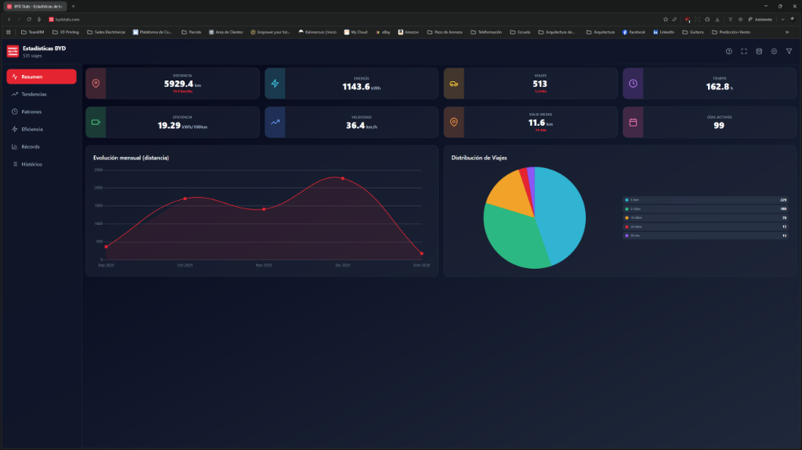
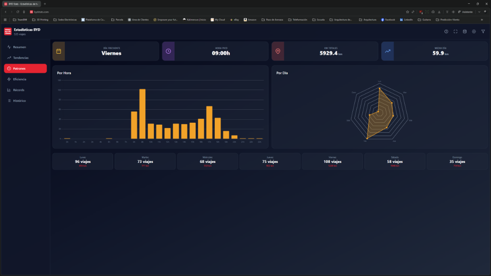
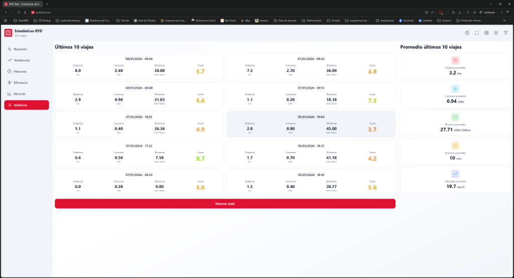
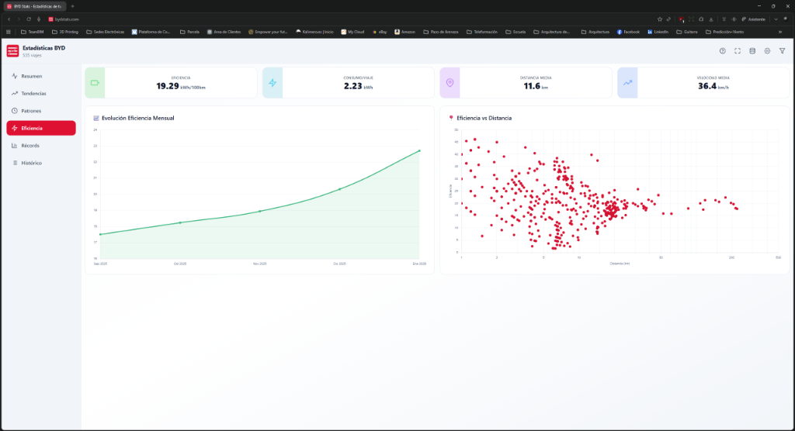

# 🚗 BYD Stats — Analizador de estadísticas de BYD

[](https://github.com/miguelpicado/byd-stats/actions/workflows/android-build.yml)
[](https://github.com/miguelpicado/byd-stats/actions/workflows/manual-build.yml)
[](https://github.com/miguelpicado/byd-stats/releases)
[](LICENSE)
[](https://bydstats.com)

Una herramienta (web + Android) para visualizar y analizar las estadísticas del vehículo BYD a partir del archivo `EC_Database.db`.

## 📌 Resumen
- Procesa el archivo `EC_Database.db` del coche localmente (sin subir datos a servidores).
- Genera gráficos y estadísticas: resumen general, tendencias, patrones de uso, eficiencia y récords de viajes.
- Disponible como aplicación web (SPA con React + Vite) y como app nativa para Android mediante Capacitor.

---

## ✨ Características principales
- Resumen de kilometraje, energía (kWh), eficiencia media y tiempo de conducción
- Tendencias por mes/día y distribución horaria
- Análisis de eficiencia (kWh/100km) y scatterplots de consumo vs distancia
- Clasificación de viajes (más largos, más eficientes, mayor consumo)
- **NOVEDAD v1.1.0:** Sincronización opcional en la nube con **Google Drive** (tus datos siguen siendo tuyos)
- Páginas dedicadas de Privacidad y Aviso Legal para cumplimiento normativo
- Funciona completamente offline: procesamiento local con `sql.js` y almacenamiento en localStorage
- App Android con mismas funcionalidades y soporte para seleccionar fichero `.db`

---

## 📸 Capturas de pantalla

### Panel de Resumen
Vista general con estadísticas clave: distancia total, consumo de energía, eficiencia media y número de viajes.



### Análisis de Patrones
Visualización de patrones de conducción por hora del día y distribución de viajes a lo largo de la semana.



### Histórico de Viajes
Listado detallado de los últimos 10 viajes con métricas completas de cada trayecto.



### Análisis de Eficiencia
Gráficos de evolución de eficiencia mensual y diagrama de dispersión de eficiencia vs distancia.



---

## 🗂️ Cómo obtener tus datos (EC_Database.db)
1. Introduce un pendrive en el puerto USB del vehículo BYD.
2. Abre la carpeta `EnergyData` en la unidad USB.
3. Copia `EC_Database.db` y arrástralo a la aplicación web (o selecciónalo desde la app Android).

> **Privacidad:** Por defecto, todos los datos se procesan en tu dispositivo con `sql.js`. La sincronización con **Google Drive** es completamente opcional y utiliza tu propia cuenta personal; nosotros no tenemos acceso a tus datos.

### 🔧 Workaround para navegadores restrictivos (Chrome 113 del BYD)

Algunos navegadores integrados en vehículos BYD (específicamente Chrome 113) no permiten seleccionar archivos `.db` directamente, mostrando únicamente "Fotos y vídeos" en el selector de archivos. Si te encuentras con este problema, sigue estos pasos:

#### Método del renombrado a .jpg

**Paso 1: Copiar el archivo desde el pendrive**
1. Con el pendrive conectado al vehículo, abre el explorador de archivos del navegador o sistema
2. Navega a la carpeta `EnergyData` en el pendrive
3. Localiza el archivo `EC_Database.db`
4. Copia el archivo a una ubicación accesible (por ejemplo, la carpeta `Downloads` o cualquier carpeta del almacenamiento interno)

**Paso 2: Renombrar el archivo**
1. En el explorador de archivos, localiza el archivo `EC_Database.db` que acabas de copiar
2. Mantén presionado sobre el archivo (long press) hasta que aparezca el menú contextual
3. Selecciona los **3 puntos** (⋮) o la opción **"Renombrar"** / **"Cambiar nombre"**
4. Cambia el nombre del archivo de `EC_Database.db` a `EC_Database.jpg`
   - **Importante:** Solo cambia la extensión `.db` por `.jpg`, mantén el resto del nombre
   - Ejemplo: `EC_Database.db` → `EC_Database.jpg`
5. Confirma el cambio

**Paso 3: Cargar el archivo en la aplicación**
1. Abre la aplicación BYD Stats en el navegador del vehículo (https://bydstats.com)
2. Haz clic en el botón **"Cargar base de datos"** o arrastra el archivo a la zona designada
3. Selecciona el archivo `EC_Database.jpg` que acabas de renombrar
4. La aplicación detectará automáticamente que es un archivo de base de datos y lo procesará correctamente

#### ¿Por qué funciona esto?

El navegador Chrome 113 del BYD restringe los tipos de archivo que se pueden seleccionar basándose en la extensión. Al renombrar el archivo `.db` a `.jpg`, el navegador lo interpreta como una imagen y permite su selección. Sin embargo, el contenido interno del archivo sigue siendo una base de datos SQLite válida, que la aplicación puede leer sin problemas independientemente de la extensión del archivo.

#### Verificación

Después de cargar el archivo, deberías ver:
- Un mensaje de confirmación indicando que la base de datos se cargó correctamente
- Las estadísticas y gráficos generados a partir de tus datos de conducción
- El nombre del archivo cargado en la interfaz (mostrará "EC_Database.jpg")

#### Solución alternativa: Usar la app Android

Si el proceso anterior resulta complicado o no funciona en tu caso, puedes:
1. Descargar la app Android desde la sección [Releases](https://github.com/miguelpicado/byd-stats/releases)
2. Instalar la APK en tu smartphone o tablet Android
3. Copiar el archivo `EC_Database.db` a tu dispositivo móvil
4. Cargar el archivo directamente desde la app sin necesidad de renombrar

La app nativa de Android no tiene estas restricciones del navegador y puede leer archivos `.db` directamente.

---

## 🚀 Uso rápido (desarrollo)
Requisitos: Node.js (preferible 18+), npm

```bash
# Clonar y ejecutar en desarrollo
git clone https://github.com/miguelpicado/byd-stats.git
cd byd-stats
npm install
npm run dev
```

- `npm run dev` → servidor de desarrollo (Vite)
- `npm run build` → build de producción
- `npm run preview` → preview del build
- `npm run deploy` → desplegar con `gh-pages` (si lo configuras)

---

## 🤖 Android — obtener la APK
Opciones:
- GitHub Actions: usa el workflow "Manual APK Build" y descarga el artefacto (recomendado)
- Releases: si existe un tag, la APK puede publicarse en Releases
- Compilar localmente: `npm run android:build` (consulta `ANDROID_BUILD.md` para detalles)

Comandos útiles:
```bash
npm run android:sync     # Build + sincronizar con Android
npm run android:open     # Abrir el proyecto Android en Android Studio
npm run android:build    # Build local de APK
```

---

## 🧰 Tecnologías
- React (19.x), Vite
- Chart.js (gráficos interactivos)
- Tailwind CSS (estilos)
- Capacitor (Android)
- SQL.js (leer `EC_Database.db` en el navegador)

---

## ✅ Requisitos y compatibilidad
- Node.js (18+ recomendado)
- Android Studio, JDK 17+ para build Android
- Android: API 21+ (Android 5.0+)

---

## 🐞 Solución de problemas
Para problemas con la compilación de la APK y CI, revisa `TROUBLESHOOTING.md`.
Si la app no carga correctamente en Android, asegúrate de haber ejecutado `npm run build` antes de sincronizar con Capacitor.

---

## 🤝 Contribuir
1. Abre un issue para discutir tu idea.
2. Haz un fork y crea una rama con tu feature o fix.
3. Envía un Pull Request con una descripción clara.

Por favor, incluye pasos para reproducir errores y capturas si es posible.

---

## 🌐 Sitio oficial
La app dispone de un sitio oficial accesible y funcional en: **https://bydstats.com**. El sitio está pensado para ser usable desde cualquier navegador, incluso desde el navegador del propio vehículo cuando sea posible.

---

## 📄 Licencia y atribución
Este proyecto se publica bajo la **Licencia MIT**. He añadido el archivo `LICENSE` en la raíz del repositorio. Por favor, conserva el aviso de copyright y la atribución a **Miguel Picado** en copias, derivados y redistribuciones.

- Se permiten forks, modificaciones y redistribución siempre que se mantenga la atribución original.
- Si necesitas una aclaración sobre uso comercial o redistribución a gran escala, contacta con el autor.

---

## 🙏 Agradecimientos
Hecho en Galicia con ❤️ — Si te sirve la herramienta, ¡compártela con la comunidad BYD!

**Diseño de logotipo e identidad visual:**
Ana Picado ([bravamundana.com](https://bravamundana.com))

---

**Documentación adicional:** [README_ANDROID.md](README_ANDROID.md) · [ANDROID_BUILD.md](ANDROID_BUILD.md) · [TROUBLESHOOTING.md](TROUBLESHOOTING.md)
